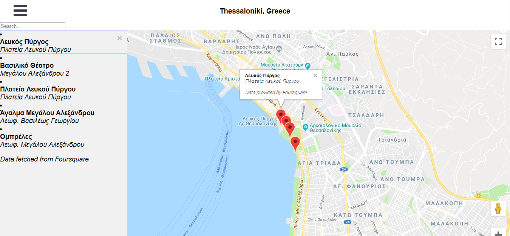

# Neighborhood Map Project


# Table of Contents

* [Overview](#overview)
* [Specification](#specification)
* [How to run the project](#how-to-run-the-project)
* [Important](#important)
* [Supported Browsers](#supported-browsers)
* [Dependencies](#dependencies-&-tools-used)
* [APIs Used](#apis-used)
* [Credits & Helpful Links](#credits-&-helpful-links)
* [Screenshot](#screenshot)
* [Next Steps](#next-steps)


## Overview

I built a single page application featuring a map of some important sights in Thessaloniki, Greece, the city I live in. I added functionality to this map including highlighted locations, third-party data about those locations and various ways to browse the content.


## Specification

The goal of this project was to build a single page map application using React & Google Maps API, plus to integrate a third-party data API and make the app accessible and usable offline.


## How to run the project

To run the project in the **development mode**, follow the instructions below: 

Download or clone the repository in your computer:
```
$ git clone https://github.com/dimikara/React-Neighborhood-Map-3.git
```

In the repository folder: 
* install project dependencies with 
```
npm install axios --save
npm install react-burger-menu --save
npm install escape-string-regexp --save
```
* start the development server with 
```
npm start
```
* open [http://localhost:3000](http://localhost:3000) to view it in the browser.


To run the project in the **build mode**, follow the instructions below.<br>
Run: 
```
npm run build
```
This command builds the app for production to the `build` folder. It correctly bundles React in production mode and optimizes the build for the best performance.

* Using a **static server**

For environments using [Node](https://nodejs.org/), the easiest way to handle this would be to install [serve](https://github.com/zeit/serve) and let it handle the rest. Run the commands:

```sh
npm install -g serve
serve -s build
```

The last command above will serve the project on the port 5000 so just open **[http://localhost:5000](http://localhost:5000)** to run the **production build** of the project.


## Important

Please note that the **Service Worker** providing offline capabilities works only in the **production build**. 


## Supported Browsers

By default, the generated project uses the latest version of React.

You can refer [to the React documentation](https://reactjs.org/docs/react-dom.html#browser-support) for more information about supported browsers.


## Dependencies & Tools Used

* As a project generated with `create-react-app`, it includes React and ReactDOM as dependencies. It also includes a set of scripts used by Create React App as a development dependency.
* The project setup also uses [Webpack](https://webpack.js.org/) for handling all assets, as Webpack offers a custom way of “extending” the concept of `import` beyond JavaScript.
* [axios](https://github.com/axios/axios), a promise based HTTP client for the browser and node.js. I used it instead of Fetch API.
* [react-burger-menu](http://negomi.github.io/react-burger-menu/), an off-canvas sidebar React component with a collection of effects and styles using CSS transitions and SVG path animations. I used it to create the off-canvas sidebar.
* [Escape RegExp](https://www.npmjs.com/package/escape-string-regexp) special characters.


## APIs used

* Google Maps API for the map.
* Places API by FourSquare, for the info fetched upon clicking a sight marker.<br>
I chose the [Get Venue Recommendations](https://developer.foursquare.com/docs/api/venues/explore), which returns a list of recommended venues near the current location.


## Credits & Helpful Links

* The project was bootstrapped with [Create React App](https://github.com/facebookincubator/create-react-app). For more information on how to perform common tasks, visit [this page](https://github.com/facebookincubator/create-react-app/blob/master/packages/react-scripts/template/README.md).
* [Udacity | Neighborhood Map - Project Explained](https://www.youtube.com/playlist?list=PLgOB68PvvmWCGNn8UMTpcfQEiITzxEEA1) by Yahya Elharony.
* This Stackoverflow question helped me in making the markers bounce only once when clicked: https://stackoverflow.com/questions/7339200/bounce-a-pin-in-google-maps-once.
* For handling errors, I followed React documentation on [Error Boundaries](https://reactjs.org/docs/error-boundaries.html) and `catch(error)`. I also used the `gm_authFailure` function according to [Google documentation](https://developers.google.com/maps/documentation/javascript/events). I put this function in a `<script>` tag in the botttom of `index.html` file. 
* I found very useful the video series: 
<br>- [React Beginner Series](https://www.youtube.com/playlist?list=PLHrxuCR-0CcT7hgVVlh0lBWTqYkEEF55m) by simonswiss &
<br> - [React For Everyone](https://www.youtube.com/playlist?list=PLLnpHn493BHFfs3Uj5tvx17mXk4B4ws4p) by Level Up Tutorials.
* Favicon generated via [Favicon & App Icon Generator](https://www.favicon-generator.org/).


## Screenshot




## Next Steps

* Deploying the project live in GitHub Pages.
* Improving the styling & general design to make the app more appealing. Add more color to the menu & design.
* Implementing a better way to handle the list of sights.
* Use more APIs to fetch more info about the sights. For example, Wikipedia, or maybe photos by Flickr.
* Make the list of sights more focused, for example, getting only sights of archaeological or other interest.
